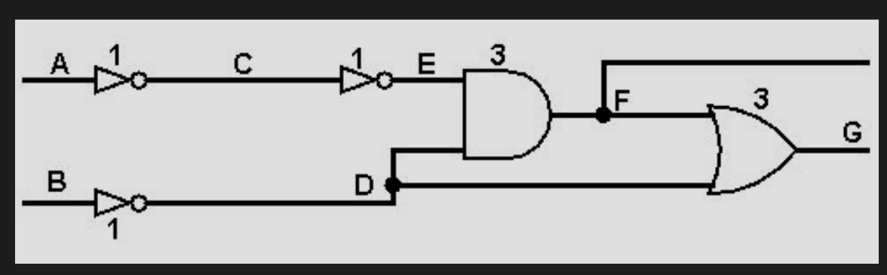

# verilog-atpg

[demo video](https://www.youtube.com/watch?v=DSQ6wMlrREo)

This tool takes a Structural Verilog source code as an input and applies ATPG algorithms to that circuit. Algorithm results will generate input and output signal patterns that will test the resulting circuit for manufacturing defects.

# Features

verilog-atpg can do the following:

- Generate ATPG for stuck-at-0 fault
- Generate ATPG for stuck-at-1 fault
- Delay timing analysis
- Critical path calculation from delays
- Path sensitization
- Critical path sensitization
- Delay fault detection
- False path detection

# Build

You can use QTCreator with provided `.PRO` file but if you wish to build without QTCreator you can use following.

Get required QT dependencies. For ubuntu:

```bash
sudo apt install qt5-default qt5-qmake libqt5charts5-dev qtmultimedia5-dev
```

Build the project.

```bash
qmake
make
```

For debug you can build the project like following:

```bash
qmake CONFIG+=debug
make
```

## Some test cases

```txt
dcirc1 N30 stuck-at-0
PIs: N5[1] N4[x] N3[x] N2[0] N1[1] N0[x]
POs: N15[D] N14[x]

dcirc1 N30 stuck-at-1
PIs: N5[1] N4[x] N3[x] N2[1] N1[1] N0[0]
POs: N15[E] N14[x]

dcirc2 N25 stuck-at-0
PIs: N2[1] N1[1] N0[1]
POs: N7[E]

dcirc2 N25 stuck-at-1
PIs: N2[1] N1[1] N0[0]
POs: N7[D]

c17 N11 stuck-at-0
PIs: N7[1] N2[1] N6[x] N3[0] N1[x]
POs: N23[D] N22[x]

c17 N11 stuck-at-1
PIs: N7[1] N2[1] N6[1] N3[1] N1[x]
POs: N23[E] N22[x]

c17 sensitize path: N3 NAND2_2 N11 NAND2_4 N19 NAND2_6 N23
PIs: N7[1] N2[0] N6[1] N3[C] N1[x]
POs: N23[C] N22[x]

dcirc2 sensitize path: N0 AND2_4 N25 NOR2_6 N7
PIs: N2[1] N1[1] N0[C]
POs: N7[C]

provided 3 delay files for test circuits
```

## Test Circuits

d_test_circ_1.v


d_test_circ_2.v


c17.v


false_path.v


